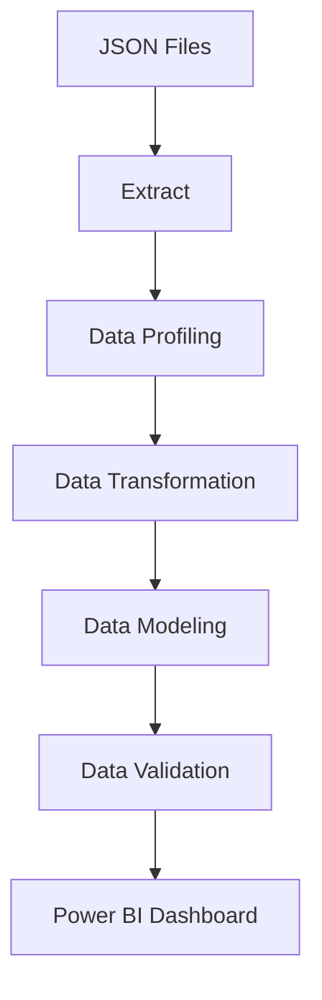

# 📊 Sales Forecast Data Warehouse & Analytics Project


---

# ✨ Project Overview

This project implements an end-to-end **Data Engineering & Analytics Pipeline** for sales and forecast data.

The pipeline extracts raw JSON data, performs profiling and transformation, builds a dimensional data model, validates data quality, and delivers business insights through an interactive Power BI dashboard.

The final solution enables sales teams to analyze historical sales, compare actual performance against forecasts, identify top customers and products, and explore trends across different geographical regions.

---

# ⚙️ Pipeline Architecture

## 1️⃣ Extract

- Read raw JSON files.
- Load datasets into Pandas DataFrames.
- Separate Sales and Forecast data sources.

---

## 2️⃣ Data Profiling

Perform exploratory analysis and quality assessment:

- Row and column counts.
- Missing values detection.
- Data type validation.
- Duplicate checks.
- Statistical summaries.

---

## 3️⃣ Data Transformation

Apply business rules and cleansing:

- Handle missing values.
- Standardize column names.
- Convert data types.
- Create derived attributes.
- Prepare datasets for modeling.

---

## 4️⃣ Data Modeling

Build a Star Schema data warehouse model.

### Dimension Tables

- Dim Customer
- Dim Product
- Dim Date
- Dim Geography

### Fact Tables

- Fact Sales
- Fact Forecast

---

## 5️⃣ Data Validation

Validate data quality using Great Expectations.

Validation checks include:

- Null checks.
- Data type validation.
- Uniqueness constraints.
- Referential integrity checks.
- Business rule validation.

---

## 6️⃣ Visualization

Interactive Power BI dashboard providing:

- Total Sales Analysis
- Sales Growth %
- Forecast vs Actual Comparison
- Top Products Analysis
- Top Customers Analysis
- Sales Trend Analysis
- Country & State Filtering

---

# 🛠️ Technologies Used

| Tool | Purpose |
|--------|----------|
| 🐍 Python | Data Engineering Pipeline |
| 📊 Pandas | Data Manipulation |
| ✅ Great Expectations | Data Validation |
| 📈 Power BI | Dashboard & Reporting |
| 📦 JSON | Source Data Storage |

---

# 📊 Data Flow Diagram



---

# 📁 Project Structure

```text
sales_forecast_project/
│
├── Extract_and_profiling/
│   ├── extract_json.py
│   └── data_profile.py
│
├── transformation/
│   └── data_transformation.py
│
├── modelling/
│   └── data_modelling.py
│
├── validation/
│   └── data_validation.py
│
├── dashboard/
│   └── Sales_Forecast.pbix
│
├── data/
│   ├── sales.json
│   └── forecast.json
│
├── requirements.txt
│
└── README.md
```

---

# 📈 Dashboard KPIs

### Sales Performance

- Total Sales
- Sales 2008
- Sales 2009
- Sales Growth %

### Forecast Analysis

- Forecast 2009
- Actual Sales 2009
- Forecast Accuracy

### Product Analysis

- Top 10 Products
- Product Contribution %

### Customer Analysis

- Top Customers
- Customer Purchase Behavior

### Geographic Analysis

- Sales by Country
- Sales by State

---

# ▶️ How to Run

## 1. Clone Repository

```bash
git clone <repository_url>
cd sales_forecast_project
```

## 2. Install Dependencies

```bash
pip install -r requirements.txt
```

or

```bash
pip install pandas numpy great_expectations pyarrow openpyxl
```

---

## 3. Run Data Pipeline

### Extract & Profiling

```bash
python Extract_and_profiling/data_profile.py
```

### Transformation

```bash
python transformation/data_transformation.py
```

### Data Modeling

```bash
python modelling/data_modelling.py
```

### Validation

```bash
python validation/data_validation.py
```

---

## 4. Open Power BI Dashboard

Open:

```text
Sales_Forecast.pbix
```

Refresh the model and explore the dashboard.

---

# 📊 Dashboard Features

✅ Sales comparison between 2008 and 2009

✅ Forecast vs Actual Analysis

✅ Top Products Analysis

✅ Top Customer Analysis

✅ Sales Trend by Month

✅ Geographic Filters

✅ Drill-down Capability

---

# 🚀 Future Enhancements

- Automate pipeline scheduling using Airflow.
- Store processed data in a cloud data warehouse.
- Add anomaly detection.
- Build forecasting models using Machine Learning.
- Deploy reports to Power BI Service.

---

